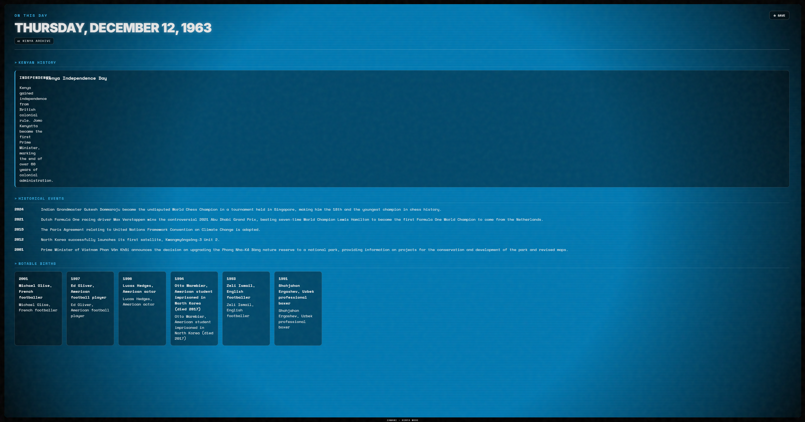

# ZAMANI – Kenya's Time Capsule

A retro TV-themed React application that lets users explore global and Kenyan history by selecting any date. Features Wikipedia events, NASA APOD, curated Kenyan milestones, and localStorage persistence. Built as Phase 1 of a 3-phase capstone project.



## Live Demo

**[View Production Build on Vercel](https://zamani-v2.vercel.app/)**

## Setup Instructions

### Prerequisites

- Node.js v18+
- pnpm (recommended), npm, or yarn

### Installation

```bash
# Navigate to client directory
cd client

# Install dependencies
pnpm install

# Start local development server
pnpm dev

🌐 ##Live Demo
View Live Production App on Vercel

The application will be available at http://localhost:5173.
APIs Used & Endpoints
This application dynamically fetches data from external web services and local curated datasets:
API
Endpoint
Purpose
Wikipedia On This Day
https://en.wikipedia.org/api/rest_v1/feed/onthisday/all/{MM}/{DD}
Fetches historical events, births, and deaths for selected dates
NASA APOD
https://api.nasa.gov/planetary/apod?date={YYYY-MM-DD}
Retrieves official NASA imagery and descriptions as visual historical artifacts
Local Kenya Dataset
client/src/api/kenyaData.js
Provides 20+ curated Kenyan historical milestones when Kenya Mode is active
Challenges & Known Bugs
API Rate Limiting: The NASA APOD API relies on a public DEMO_KEY, which imposes strict hourly rate limits if users cycle rapidly through multiple dates. Graceful error-handling components were built to display fallback UI elements if rate limits are exceeded.

CRT Screen Distortion Overlay: Implementing the retro SVG physics-based CRT warp (<feTurbulence>) required adjusting pointer-events: none to prevent the graphical scanline layer from intercepting and blocking mouse clicks on interactive buttons.

Project Roadmap
Phase 1: React frontend + external APIs ✅
Phase 2: Flask backend + PostgreSQL database (upcoming)
Phase 3: JWT authentication + user-owned capsules (upcoming)
Tech Stack
React 18 + React Router v6
Context API for state management
react-datepicker with custom retro styling
Axios for API calls
Custom CSS with CRT scanline animations
localStorage for client-side persistence
```
